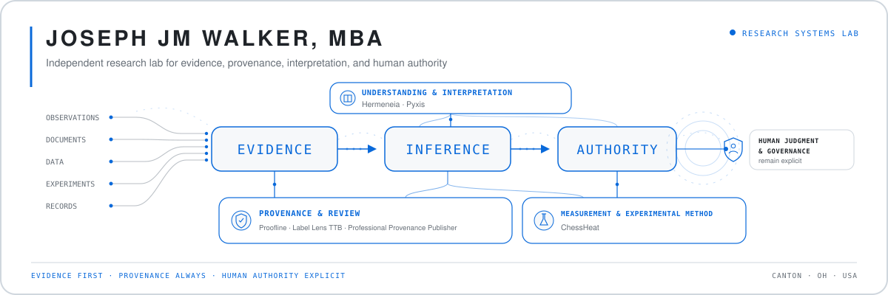
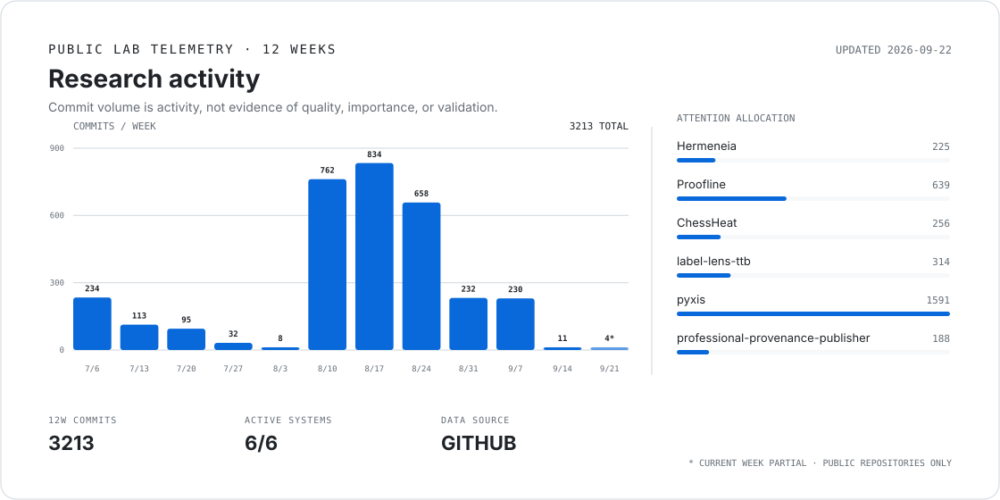

<picture>
  <source media="(prefers-color-scheme: dark)" srcset="./assets/lab-header-dark.svg">
  <source media="(prefers-color-scheme: light)" srcset="./assets/lab-header-light.svg">
  
</picture>

> I build research systems that preserve the difference between **evidence, inference, and authority**.

I work **full-stack**, from persistence, server-side policy, authentication, deterministic evaluation, and research runtimes through interfaces, deployment, and operator tooling. My work spans AI-assisted inquiry, public-record intelligence, governed review, scientific measurement, and research tooling. The projects differ by domain; the recurring problem is the same: **how do we make useful systems without allowing convenience, automation, or compelling narratives to outrank the evidence?**

---

## Lab status

| System | Research question | State |
| --- | --- | --- |
| [**Hermeneia**](https://github.com/JosephJMWalker-MBA/Hermeneia) | How can understanding evolve without losing provenance or human authority? | `VALIDATION` |
| [**Proofline**](https://github.com/JosephJMWalker-MBA/Proofline) | How can public records become reproducible investigative evidence without automating accusation? | `FIELD VALIDATION` |
| [**ChessHeat**](https://github.com/JosephJMWalker-MBA/ChessHeat) | Which spatial claims about chess consequence can actually be earned by measurement? | `PREREGISTRATION` |
| [**Label Lens TTB**](https://github.com/JosephJMWalker-MBA/label-lens-ttb) | How can regulatory review be assisted without pretending software has regulatory authority? | `DEPLOYED PROTOTYPE` |
| [**Pyxis**](https://github.com/JosephJMWalker-MBA/pyxis) | Can research and software transformations remain inspectable from intent through evidence? | `ACTIVE DEVELOPMENT` |

---

## Lab telemetry

<picture>
  <source media="(prefers-color-scheme: dark)" srcset="./assets/lab-activity-dark.svg">
  <source media="(prefers-color-scheme: light)" srcset="./assets/lab-activity-light.svg">
  
</picture>

GitHub-backed public-repository telemetry. Activity is not treated as evidence of quality or importance. → [Open operator dashboard](./DASHBOARD.md)

---

## Languages in the lab

The implementation layer changes with the problem. These are the primary languages I reach for across the lab:

| Language | Typical role |
| --- | --- |
| **`Python`** | Research systems, data and ML work, automation, experimental tooling |
| **`TypeScript`** | Production web systems, governed workflows, interfaces and application logic |
| **`Dart`** | Cross-platform application development |
| **`Swift`** | Native Apple-platform prototypes and interfaces |

Frameworks and platforms stay secondary to the language and the research problem; they are documented in the repositories where they matter.

---

## Selected technical capabilities

| Area | Working tools & methods |
| --- | --- |
| **AI & model systems** | LLMs, RAG, vector databases, transformers, NLP, prompt engineering, fine-tuning, LangChain |
| **ML & interpretability** | PyTorch, TensorFlow, scikit-learn, XGBoost, SHAP, LIME, Integrated Gradients, data science |
| **Vision & edge** | Computer vision, OpenCV, OCR, Edge AI |
| **Production systems** | Systems/software architecture, SQL and database design, REST/API development, Docker, CI/CD, deployment, environment configuration, MLOps |
| **Application layer** | Next.js, React, HTML5, CSS3, BTCPay Server |

---

## Full-stack systems work

I build end to end. The backend is usually where the governing logic, evidence contracts, and durable state live; the interface exists to expose those systems clearly rather than recreate them.

| Layer | Typical work |
| --- | --- |
| **Backend & data** | Relational schemas, MySQL persistence, migrations, database-backed sessions, server-side authorization, immutable revisions, append-only histories |
| **Application & research logic** | Deterministic rules, evidence pipelines, provenance, integrity checks, compiler/runtime boundaries, exports, validation and orchestration |
| **APIs & protected workflows** | Authenticated handlers, role-aware operations, durable claims and decisions, controlled file access, bounded server-side processing |
| **Frontend & interaction** | Production web interfaces, research shells, reviewer/operator workflows, responsive application state, cross-platform and native clients |
| **Delivery & operations** | CI validation, multi-version testing, production builds, migrations, deployment health, runtime and deployed-commit provenance |

Concrete examples: [**Label Lens TTB**](https://github.com/JosephJMWalker-MBA/label-lens-ttb) carries governed review from authenticated UI through server-side authorization, MySQL-backed state, immutable revisions, integrity signing, and production deployment; [**Pyxis**](https://github.com/JosephJMWalker-MBA/pyxis) carries human intent through canonical state, compilation, runtime evidence, persistence, verification, CLI/UI, and portable output.

---

## Research programs

**Understanding & interpretation**  
Systems for preserving how understanding develops rather than retaining only the final answer.  
→ [Hermeneia](https://github.com/JosephJMWalker-MBA/Hermeneia) · [Pyxis](https://github.com/JosephJMWalker-MBA/pyxis)

**Evidence, provenance & authority**  
Infrastructure that keeps source records, derived observations, machine assistance, and human judgment distinguishable.  
→ [Proofline](https://github.com/JosephJMWalker-MBA/Proofline) · [Label Lens TTB](https://github.com/JosephJMWalker-MBA/label-lens-ttb)

**Measurement & experimental method**  
Research where attractive explanations are allowed to fail, negative results remain part of the record, and the model has to earn the visualization.  
→ [ChessHeat](https://github.com/JosephJMWalker-MBA/ChessHeat)

---

## Selected publications

A small cross-section of the larger publication record, chosen for direct connection to the research program represented here.

**AI systems, provenance & control**  
- *Technical Disclosure: Provenance-Aware Guardrails for Outcome-Grounded AI Learning Systems*
- *A Topology for Deployment Validity: On Versioning, Runtime State, and Provenance in AI Systems*
- *Anchored Generation: A General Architecture for Controlled Synthetic Data, Semantic Drift Reduction, and Equitable Model Training*
- *Python for Gated Evolution: A Conceptual Framework for AI-Native System Control*

**Governance, oversight & digital systems**  
- *Human Oversight in Automated Administrative Systems*
- *Digital Due Process as System Architecture*
- *The Right to Dignity, Voice, and Redress: A Due Process Framework for Emotionally Aware AI Systems*

---

## Current questions

- What information must survive so AI-assisted understanding can be inspected, revised, and handed forward without flattening its history?
- How far can deterministic evidence and provenance take us before additional model complexity is actually justified?
- How should a system represent uncertainty, negative evidence, and unresolved questions without turning them into either noise or false certainty?

---

## Lab protocol

**Evidence before narrative.** A persuasive explanation does not strengthen weak evidence.

**Authority stays explicit.** Generation, extraction, measurement, evaluation, and human judgment are different acts.

**Negative results count.** A falsified hypothesis can narrow the search space more honestly than a rescued result.

**Provenance travels with the claim.** Important outputs should retain enough lineage to inspect how they came to exist.

---

### Research infrastructure

[Professional Provenance Publisher](https://github.com/JosephJMWalker-MBA/professional-provenance-publisher) treats professional presentation as a generated surface of a reviewed, source-controlled record rather than an independently maintained biography.

This profile is intentionally selective. The repository archive is the workshop; this page is the lab dashboard.
